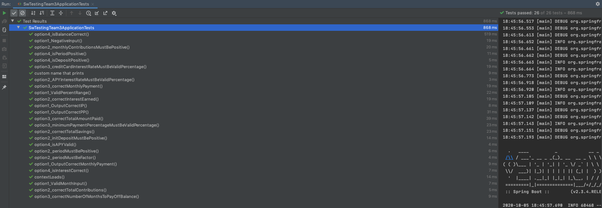

# Report #1

#### Naming and Organizational Conventions
We have our all of our unit tests in a separate testing file and we organized the naming each unit test by the function number being tested and then followed by a short description of what the test would be.

 #### Screenshots of all test suites and tests passing

 #### Screenshots of Test Coverage

#### Screencast Videos
Red-Green-Refactor demo:
https://youtu.be/vDE49xJP3qI

Functionality demo:

#### Tag name for PP Assignment 1
vPP.1

commit : 485ae981ae0e22d45e51aea94c784fc3d1e0d50f
