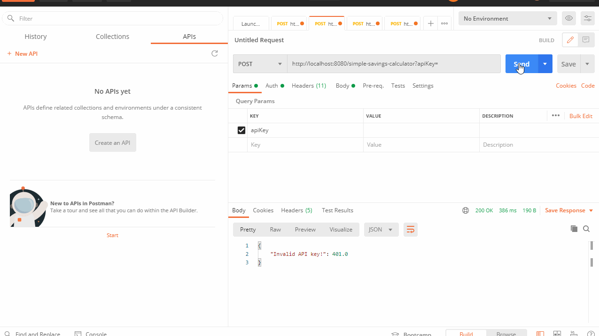

# PPA #2 Report

#### Screencast Demos

Milestone #1 Demo - Unit tets to mock http requests:

Milestone #2 Demo - Endpoint with API key:

## Testing Documentation

### Unit Tests

**Function 1: Credit Card Payoff**

*option1_NegativeInput*: Checks that negative input for CC balance is not allowed. Included to verify that function can handle bad input.  
Acceptable Range: [0, INF]  
Tags: #negative-test #edge-case 

*option1_ValidPercentRange*: CC interest rate should be inputted as a percent float representation between 0-100.  
Acceptable Range: [0, 100]  
Tags: #negative-test #edge-case  

*option1_ValidMonthInput*: Tests to see desired months to payoff must be at least one.  
Acceptable Range: [1, INF]  
Tags: #negative-test #edge-case  

*option1_OutputCorrectMonthlyPayment*: Function checks to see if the correct monthly payment is output based on the input and in the right format (2 decimal places / nearest cent).  
Tags: #happy-path   

*option1_OutputCorrectPP*: Function checks to see if the correct total principle paid is output based on known inputs.  
Tags: #happy-path  

*option1_OutputCorrectIP*: Function uses inputs that make it easy to calculate interest paid and compares output done by hand vs output that function returns.  
Tags: #happy-path  

**Function 2: Simple Savings Calculator**  
*option2_initDepositMustBePositive*: Checks that negative input for the initial deposit is handled. Included to verify that function can handle bad input.  
Acceptable Range: [0, INF]  
Tags: #negative-test #edge-case  

*option2_monthlyContributionsMustBePositive*: Checks that negative input for the monthly contributions is handled. Included to verify that function can handle bad input.  
Acceptable Range: [0, INF]  
Tags: #negative-test #edge-case  

*option2_APYInterestRateMustBeValidPercentage*: Checks that negative input for the APY interest rate is handled. Included to verify that function can handle bad input.  
Acceptable Range: [0, 100]  
Tags: #negative-test #edge-case  

*option2_periodMustBePositive*: Checks that negative input for the period(years) is handled. Included to verify that function can handle bad input.  
Acceptable Range: [1, INF]  
Tags: #negative-test #edge-case  

*option2_periodMustBeFactor*: The period in years can be a whole number or include a half (e.g. 2.5 years but not 2.75). This function chekcs to see if the input period has no remainder when divided by 0.5.  
Tags: #negative-test #edge-case  

*option2_correctTotalSavings*: Using inputs that make it easy to calculate simple savings by hand (or verify with online tool), this function compares the expected total savings and the total savings output by the function.  
Tags: #happy-path   

*option2_correctTotalContributions*: Using inputs that make it easy to calculate simple savings by hand (or verify with online tool), this function compares the expected total contributions and the total contributions output by the function.  
Tags: #happy-path  

*option2_correctInterestEarned*: Using inputs that make it easy to calculate simple savings by hand (or verify with online tool), this function compares the expected interest earned and the interest earned output by the function.  
Tags: #happy-path  

**Function 3: Credit Card Minimum Payment Calculator**  
*option3_creditCardBalanceMustBePositive*: This function checks to see if the CC balance is positive and that bad input is handled appropriately.  
Acceptable Range: [0, INF]  
Tags: #negative-test #edge-case  

*option3_creditCardInterestRateMustBeValidPercentage*: This function checks to see if the interest rate is between 0 and 100 (valid percent) and that bad input is handled appropriately.  
Acceptable Range: [0, 100]  
Tags: #negative-test #edge-case  

*option3_minimumPaymentPercentageMustBeValidPercentage*: This function checks to see if the minimum payment percentage is between 0 and 100 (valid percent) and that bad input is handled appropriately.  
Acceptable Range: [0, 100]  
Tags: #negative-test #edge-case  

*option3_correctMonthlyPayment*: Checks to see if the Credit Card Minimum Payment Calculator outputs the expected correct monthly payment based on known inputs.  
Tags: #happy-path  

*option3_correctNumberOfMonthsToPayOffBalance*: Checks to see if the Credit Card Minimum Payment Calculator outputs the expected months to pay off based on known inputs.  
Tags: #happy-path  

*option3_correctTotalAmountPaid*: Checks to see if the Credit Card Minimum Payment Calculator outputs the expected total amount paid based on known inputs.  
Tags: #happy-path  

**Function 5: CD Calculator**

*option4_isDepositPositive*: Checks to see if the initial deposit is positive  and handles bad input.  
Acceptable Range: [0, INF]  
Tags: #negative-test #edge-case  

*option4_isPeriodPositive*: Checks to see if the period is valid (positive and non-zero) and that it deals with bad input without crashing.  
Acceptable Range: [1, INF]  
Tags: #negative-test #edge-case  

*option4_isAPYValid*: Checks to see if the APY interest is a valid percent and that it deals with bad input without crashing.  
Acceptable Range: [0, 100]  
Tags: #negative-test #edge-case  

*option4_isBalanceCorrect*: This function checks to see if the certificate of deposit calculator function returns the expected balance based on pre-determined inputs.  
Tags: #happy-path  

*option4_isInterestCorrect*: This function checks to see if the certificate of deposit calculator function returns the expected interest based on pre-determined inputs.  
Tags: #happy-path  

### Integration Tests

**Revoke API Tests**

*addUserTest*: This test sends a post request to the /firestoreauth endpoint and adds a test user to the Firestore database.
Tags: #mock #integration

*revokeKeyTest*: This test send a post request to the /revokeKey endpoint and removes the specified API key from our Firestore database.
Tags: #integration

**Authentication API Tests**

*cdAuthTest*: This test sends a post request to the /cd-calculator endpoint. The JSON object does not contain an API key so the request should be denied.
Tags: #negative-test #integration 

*ccMinAuthTest*: This test sends a post request to the /credit-card-min-payment-calculator endpoint. The JSON object does not contain an API key so the request should be denied.
Tags: #negative-test #integration 

*ssAuthTest*: This test sends a post request to the /simple-savings-calculator endpoint. The JSON object does not contain an API key so the request should be denied.
Tags: #negative-test #integration 

*ccPayoffAuthTest*: This test sends a post request to the /credit-card-payoff endpoint. The JSON object does not contain an API key so the request should be denied.
Tags: #negative-test #integration 

*revokeKeyTest*: This test sends a post request to the /revokeKey endpoint. The API key being sent does not exist in the Firestore database so a message is printed telling the user that the user associated with that key does not exist.
Tags: #negative-test #integration

**Post API Tests**

*cdPOSTTest*: This test sends a post request to the /cd-calculator endpoint. A valid API key is sent with the request so the request is able to be processed. The test ensures that the correct values are obtained and the request and response are added to the Firestore database.
Tags: #happy-path #integration

*ccMinPOSTTest*: This test sends a post request to the /credit-card-min-payment-calculator endpoint. A valid API key is sent with the request so the request is able to be processed. The test ensures that the correct values are obtained and the request and response are added to the Firestore database.
Tags: #happy-path #integration

*ssPOSTTest*: This test sends a post request to the /simple-savings-calculator endpoint. A valid API key is sent with the request so the request is able to be processed. The test ensures that the correct values are obtained and the request and response are added to the Firestore database.
Tags: #happy-path #integration

*ccPayoffPOSTTest*: This test sends a post request to the /credit-card-payoff endpoint. A valid API key is sent with the request so the request is able to be processed. The test ensures that the correct values are obtained and the request and response are added to the Firestore database.
Tags: #happy-path #integration

## Database Schema Documentation

Our project uses Google's Firestore as our database. Firestore is a cloud-hosted, NoSQL database. We have two collections:

1. users: This collection contains all the users that have been given API keys. Before any request is logged, we check to make sure that the API key sent with the request belongs to one of the documents present in this collection. A document in the users collection consists of the following data:
* API Key
* Email
* Full Name
* Industry
* Organization Name

2. API-Calls: This collection contains all the requests and responses that have been passed through our API. If a request is sent with a valid API key, then that request is processed, a response is created, and then the request and response are logged together as one document. A document in the API-Calls collection consists of:
* IP Address
* Body of the request
* Body of the response
