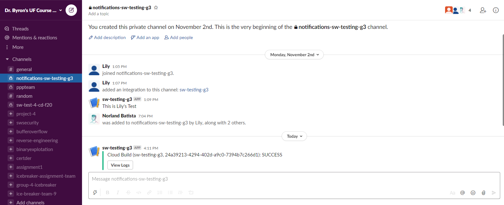
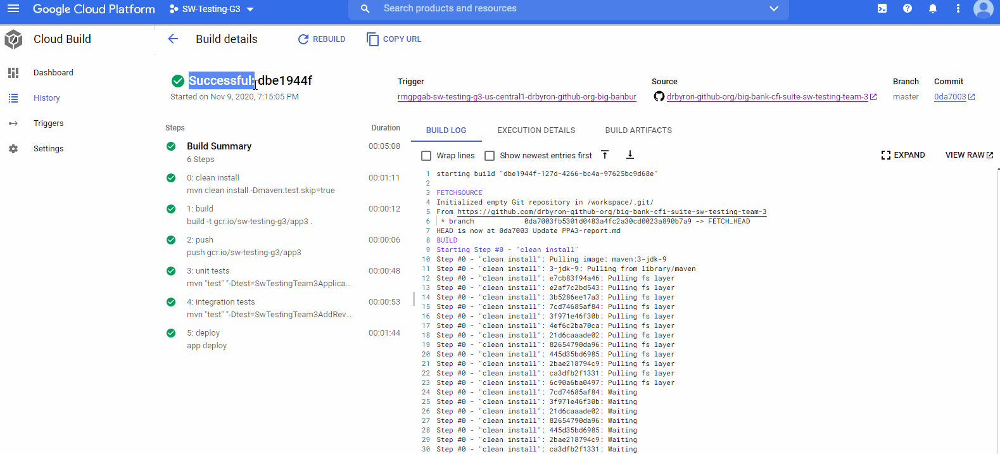

# PPA #3 Report 
## Linter and Coding Style:
### Style guide
We used the Google Java style guide which has five main style sections - Source files, formatting, naming, programming practices, and javadoc. 
We selected the Google Java style guide as it integrated well with our Intellij IDE and maven.  

To enforce the Google stye guide, we used the checkstyles plugin. Upon compile, the source code is statically checked to see if they adhere to the style guide in placed. If they are not, an error will show. We selected checkstyles as our linter to enforce the style guide because it covered everything that we needed and had great integration with the style guide we were using.

Resources used: 
checkstyle - https://github.com/checkstyle/checkstyle

Google Java Style Guide - https://google.github.io/styleguide/javaguide.html

## Continuous Integration Process:
### CI setup
The continuous integration setup is defined in a `cloudbuild.yml` file, with stages for building, unit tests, integration tests, and deployment. 
By default, every commit to the master branch will go through all stages defined above, but the 
unit and integration tests can be skipped by executing a bash script prior to committing changes to the master branch 
(more details in the emergency deployment section). The motivation for this is so that we are able skip tests and deploy in the case
of an emergency, as required in the assignment specification.

Screencast:
https://youtu.be/7k1Rvvn9eEU
 
## Emergency Deployment Setup:
#### Implementation and Rationale
The emergency deployment bash script gives us the ability to bypass testing steps in the continuous integration process to deploy straight towards production.

This script makes use of three variations of the Cloud Build configuration file:

* `cloudbuild.yml` - the base Cloud Build configuration file used by our master branch trigger; will be edited by the script.
* `cloudbuild_unit.yml` - Cloud Build configuration file containing only the unit testing step of the CI process.
* `cloudbuild_integ.yml` - Cloud Build configuration file containing only the integration testing step of the CI process.

Via `sed`, this script will inject any combination of the steps defined in the unit and integ files in between the `#REMOVABLE_START` and `#REMOVABLE_END` flags within the `cloudbuild.yml`, given an argument. This way we simulate a switch between types of build configurations before committing and while also keeping our code modular.

#### Execution Steps

1. Before committing to the master branch, open a new terminal window and locate to the SWTestingTeam3 directory.

2. Execute the script by calling `bash ./em.bash <build-type>`

   _Build Type Arguments:_
   
   * `unit` - build, run only unit tests.
   * `integ` - build, run only integration tests.
   * `no_tests` - build without running any tests.

   _*If no argument is specified, cloudbuild.yml will be set to default, i.e. build and run all tests._

3. Commit and push your changes. Build will start automatically via a trigger.


## Rollback Process:
Steps to rollback a production release to an earlier version

  - Go to the Google Cloud Platform Cloud Run Console
  - Click on the name of the service that needs to be updated
  - Click on the Revisions tab
  - Click the ellipsis icon to the right of the revision you want to rollback to
  - Click Manage Traffic and then:
    - Select the revision version
    - Set it's traffic percentage to 100%
    - Set the current revision's traffic percentage to 0%
    - Click save

### Rollback to Previous Github Commit:

Steps to rollback to a previous Github commit:

- Go the repository's commit log and identify the commit you want to rollback to
- Copy the commit ID associated with that commit
- Run the following command in your terminal:
    ```
    git reset --hard <old-commit-id>
    ```
- The run the following command:
    ```
    git push -f <remote-name> <branch-name>
    ```
- Once the code has been pushed to master, the trigger will cause this version of code to build and be deployed


Every revision can be tagged with the Github commit that corresponds to it. This helps us translate the app engine version to an actual commit ID.
Continuous Integration tools are very useful if a rollback is required because they ensure that previous versions of the project work properly. They also run all the test suites before deploying the project. 

Screencast:
https://youtu.be/a56mY6l-hlU

## CI Integration with Slack:
### Screenshot of CI integration with slack




### Screencast of CI Integration with slack


## Challenges Faced:
Rollback Process - I (Rohan) was responsible for the rollback process, which was completed after the deadline. It took me a while to figure out how to do it because I had to do a lot of research on how to properly use Google App Engine and how to use it's version system to migrate traffic back to a previous deployment of the system.