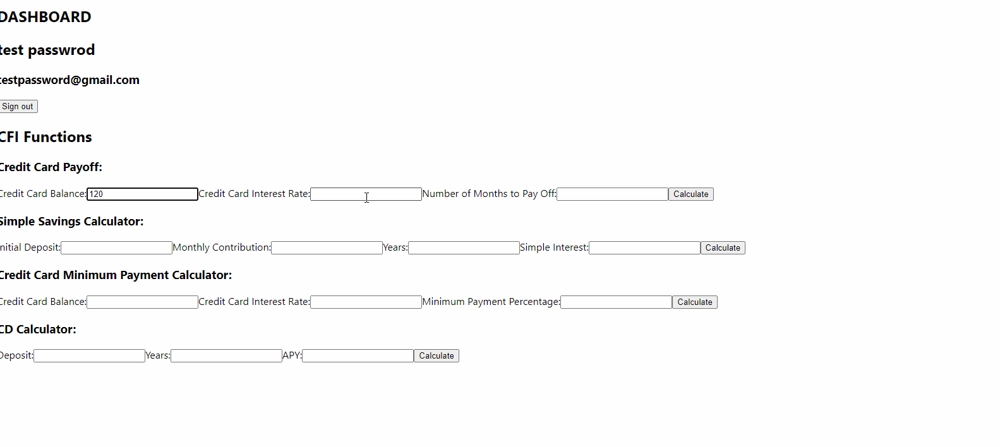

# PPA #4 Report 
## Milestone #1 - Working Registration and Authentication


## Milestone #2 - CFI Functions Accessible via the Dashboard Page



## Milestone #3 - BAMS Mock Interface


## Admin Logs Interface

To log in as the admin user, use email: `admin@test.com` and password: `adminadmin`

## Screencasts

#### E2E Test showing invalid login attempt
https://youtu.be/SRNWsCKd5fo

#### All Happy Path Tests and an Invalid Transfer Funds Attempt
https://youtu.be/qjMdJyiolTs

#### Working Production Implementation (happy path) (create customer, login, create account, deposit, and use CFI function)
https://youtu.be/wnE9MVOq0lc

#### Admin API Logs
https://youtu.be/CPddqglURQw

#### Manually attempting an invalid login
https://youtu.be/_gaMdy4DLdk

#### QA Testing with Erroneous Input
https://youtu.be/8pmLrAKq0g4


#### Instructions for Testing
First, clone our project from GitHub. cd into SWTestingTeam3. Now run the following command:

-Command to run spring-boot project: ```./mvnw spring-boot:run```  
Now go to SWTestingTeam3/frontend/cypress.json and replace "baseUrl": "http://localhost:3000" with "baseUrl": "https://cloud-challenge-nyccgtirxq-uc.a.run.app/" .

-Open another Terminal and run ```npm run e2e```  

#### Issues with Cypress
We had our cloudbuild.yml set up to install and run cypress but we got an error saying "You're caching node_modules but are not caching this path.". We were unable to fix this issues by the required deadline.

### Issues with CFI API
We have it successfully deployed at sw-testing-g3-7ktengsnva-uc.a.run.app but our deployed frontend can not connect to it. This is why the spring boot API must be run locally on localhost:8080.
